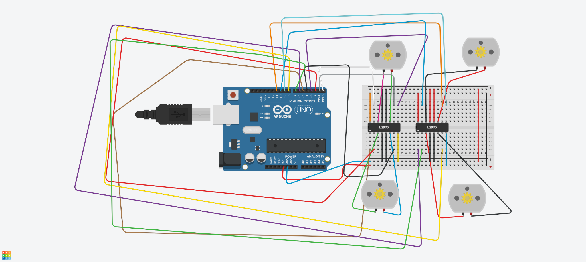

# 🤖 Arduino 4 Motor Robot

A four-wheel robot car built using **Arduino Uno**, **two L293D motor driver ICs**, and **four DC motors**.  
The circuit was designed and tested using **Tinkercad**.

---

## 📖 Project Overview

This project demonstrates how to control four DC motors using two L293D motor driver ICs connected to an Arduino Uno.

The simulation was created and tested in Tinkercad before real hardware implementation.

---

## 🛠 Hardware Components

- Arduino Uno
- 2 × L293D Motor Driver IC
- 4 × DC Motors
- Breadboard
- Jumper Wires
- USB Power Supply

---

## 📁 Repository Contents

| File | Description |
|------|-------------|
| `README.md` | Project documentation and usage instructions. |
| `circuit_diagram.png` | Wiring diagram of the complete circuit. |
| `robot_demo.mp4` | Video demonstrating the robot simulation. |

---
## 🔗 Tinkercad Simulation

Click here to open the project:

[Open Tinkercad Project](https://www.tinkercad.com/things/bXBS5RNoncG-cool-duup/editel?returnTo=https%3A%2F%2Fwww.tinkercad.com%2Fdashboard&sharecode=cpDcGHV2auMPjXA-38oMTp3MG7rkrZAqEeVotNF-gXQ)

## 📷 Circuit Diagram

---

## 🎥 Demonstration

The repository includes a simulation video:

**robot_demo.mp4**

---

## 🚀 How to Use

1. Open the Tinkercad project using the link above.
2. Review the wiring diagram.
3. Start the simulation.
4. Observe the operation of the four DC motors.

---

## 📌 Project Features

- Four DC motor control.
- Two L293D motor drivers.
- Arduino Uno based design.
- Tinkercad simulation.
- Beginner-friendly wiring.

---

## 👨‍💻 Author

**Hashim Almaramhi**

Artificial Intelligence Student

GitHub: https://github.com/halmaramhi-hue
